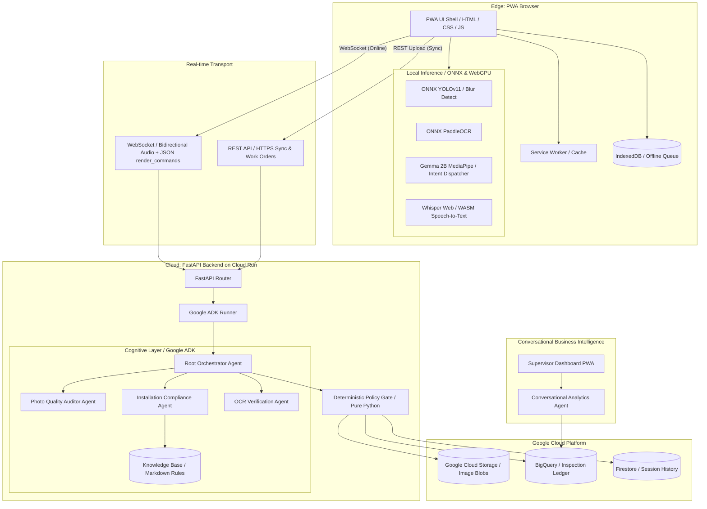

# Architecture — System Design

## Overview
FieldOps is a hybrid offline-first PWA with an Agentic Cloud backend designed to guide field technicians through ONT/ONU installations and validate work quality in real-time. The system uses a client-side command dispatcher (offline) and a WebSocket-based cloud Live Agent (online) powered by Google ADK and Gemini 2.5 Flash Native Audio. The cloud backend processes and validates inspection payloads through a multi-agent validation pipeline, applying deterministic policy gates before storing results in Cloud Storage and BigQuery.

## Architecture Diagram

## Components

### 1. Edge PWA (Client)
- **Responsibility**: Provides the touch interface, camera viewfinder with overlay guides, and local offline/online control loops. Captures photos/audio, runs edge AI models, manages the offline queue, and handles Background Sync.
- **Technology**: Vanilla HTML5, CSS3 (Modern custom design), JavaScript (IIFE modules, WASM, WebGPU), IndexedDB, Service Worker API, MediaDevices API, ONNX Runtime Web, MediaPipe LLM Inference API, browser Web Speech API (TTS).
- **Interfaces**:
  - WebSocket connection to FastAPI backend for connected Live Agent mode (bidirectional 16kHz audio / JSON `render_command` protocol).
  - HTTPS endpoints for REST sync and mock work order retrieval.
- **Data**: Owns the local cache, pending upload queue, active work order state, and step-by-step progress history in `IndexedDB`.

### 2. FastAPI Backend & Gateway
- **Responsibility**: Serves as the entry gateway. Hosts the REST endpoints and manages WebSocket lifecycles. Orchestrates the ADK live audio runner and handles client disconnection and reconnects.
- **Technology**: Python 3.11, FastAPI, Uvicorn, websockets.
- **Interfaces**:
  - Exposes `/api/v1/health` (Health).
  - Exposes `/api/v1/work-orders` (Mock Work Orders).
  - Exposes `/api/v1/sync` (Queue Uploads).
  - Exposes WebSocket at `/ws/{user_id}/{session_id}`.
- **Data**: Does not own persistent data; acts as stateless router/agent runner.

### 3. Cognitive Agent Layer (Google ADK)
- **Responsibility**: Orchestrates the multi-agent logic, tool executions, and LLM-based reasoning/routing.
- **Technology**: Google ADK (`google-adk`), Gemini 2.5 Flash Native Audio (Live WebSocket), standard Gemini 1.5 Flash (vision/text).
- **Interfaces**:
  - Routes requests via ADK's `transfer_to_agent()` interface.
  - Implements grounding callbacks (`_grounding_before_tool` and `_grounding_after_tool`) to intercept and sanitize tool parameters and responses.
- **Data**: Concatenates local static markdown knowledge base files (FTTH engineering specifications) into prompt memory.

### 4. Deterministic Policy Gate
- **Responsibility**: Enforces hard safety, format, and logical business constraints on all output structures before saving to database (no LLM, pure Python). If a constraint is violated, triggers the ADK self-correction loop.
- **Technology**: Python 3.11, Pydantic (schema enforcement).
- **Interfaces**:
  - Intercepts all output from the root orchestrator.
- **Data**: Validation schemas.

### 5. Persistence Layer (GCP)
- **Responsibility**: Stores and indexes all audit media, structured verdicts, session tracking, and historical context.
- **Technology**: Google Cloud Storage (Object Store), BigQuery (Data Warehouse), Google Cloud Firestore (Document store).
- **Interfaces**:
  - GCS client library (Image upload).
  - BigQuery client library (Verdict ingestion).
  - Firestore client library (Session storage).
- **Data**: Owns stored JPEG photos, transaction logs, final audit reports, and past inspection history.

## Data Flow

### A. Offline Capture & Sync (Conductor Mode)
1. **Technician captures photo**: Camera captures photo -> metadata appended (GPS, timestamp).
2. **Local AI Check**: PWA runs local ONNX blur/exposure/framing models. If failed, alerts technician to retake. If pass, saves to `IndexedDB` upload queue.
3. **Local OCR Check**: Edge PaddleOCR extracts serial/MAC, technician validates and confirms.
4. **Sync Event**: Network is restored -> Background Sync fires -> payloads sent to `/api/v1/sync`.
5. **Cloud Pipeline**: FastAPI receives payload -> passes to root orchestrator agent -> runs sub-agents -> saves raw images to GCS and final structured JSON report to BigQuery.

### B. Live Connected Voice Session (Live Agent Mode)
1. **WebSocket Open**: PWA establishes WebSocket stream with backend.
2. **Audio Streaming**: Browser captures 16kHz mono audio -> streams to backend -> forwarded to Gemini Live API via ADK runner.
3. **Agent Action (Tool Call)**: Technician says "validate installation" -> Gemini triggers `validate_current_step` tool -> backend returns a `render_command` with current step evaluation -> PWA updates UI (optimistic display) -> tool returns JSON data -> PWA renders final quality metrics.
4. **Agent Response (Audio)**: Gemini streams 24kHz audio output -> PWA plays audio stream. Technician can interrupt (barge-in handler flushes playback).

## Integration Points

| System | Purpose | Protocol | Auth |
|--------|---------|----------|------|
| Vertex AI Live API | Real-time Native Audio Gemini inference | WebSocket | IAM / ADC |
| Vertex AI Gemini API | Cloud vision and OCR agent reasoning | HTTPS REST | IAM / ADC |
| Google Cloud Storage | Secure repository for HD evidence photos | HTTPS | IAM / ADC |
| BigQuery | Analytical ledger for final reports | HTTPS | IAM / ADC |
| Firestore | Per-technician history storage | HTTPS gRPC | IAM / ADC |

## Architecture Decision Records

| ADR | Decision | Date |
|-----|----------|------|
| `docs/ADR/001-hybrid-agentic-model.md` | Adopt Gemini 2.5 Flash Native Audio for Live voice + Gemma 2B for local offline conduction. | 2026-07-06 |
| `docs/ADR/002-render-command-ui.md` | Use ORION's `render_command` JSON protocol for UI transitions driven by agent tool calls. | 2026-07-06 |
| `docs/ADR/003-safety-gates.md` | Enforce deterministic Pydantic policy gates to intercept and validate all structured JSON outputs before persistence. | 2026-07-06 |
| `docs/ADR/004-static-knowledge-base.md` | Place FTTH engineering rules in static `.txt` files loaded directly into system instructions, avoiding vector DB retrieval latency. | 2026-07-06 |

## Constraints

- **Connectivity**: Mobile devices will routinely drop connections. All core capture logic must work with zero network.
- **Hardware Limitations**: In-browser local model execution must fit within mobile browser resource allocations (WASM/WebGPU compatibility).
- **Latency**: Voice loop must maintain conversational flow (< 3s response time over WebSockets).
- **Privacy**: Photos may capture customer PII. Edge models should blur faces/inadvertent visual PII locally before cloud synchronization.

## Evolution Plan

- **Phase 2 (Cloud Acceleration)**: Deploy NVIDIA NIM (DINOv2) containerized services on GKE for advanced visual anomaly and bend-radius audits, removing visual load from the LLM.
- **Phase 3 (Enterprise Sync)**: Transition from mock databases to real-world integration with OSS/BSS and physical optical ping instrumentation using real MCP servers.
- **Phase 4 (Model Distillation)**: Implement NVIDIA TAO pipelines to distill custom FTTH defect detection models down to lightweight client-side ONNX models.
