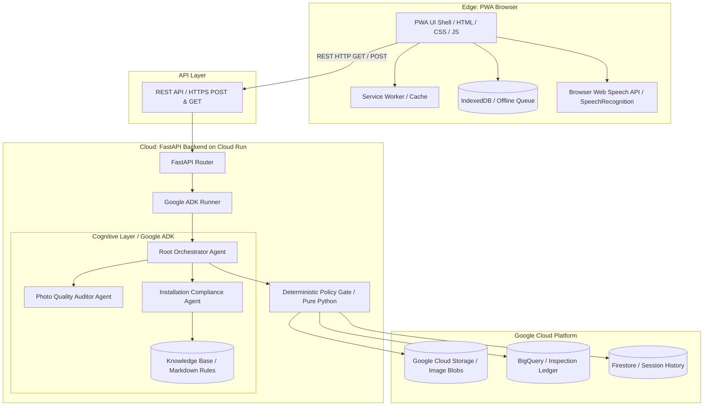

# Architecture — System Design (New Cycle)

## Overview
FieldOps is a Guided FTTH (Fiber-to-the-Home) photo uploader and audit assistant. The client-side PWA provides a step-by-step upload walkthrough, uses the browser's local SpeechRecognition API for hands-free text entry, and calls standard REST endpoints. The FastAPI backend orchestrates a multi-agent cognitive layer (powered by Google ADK and Gemini Vision) to perform instant quality and engineering compliance audits on uploaded photos. A final Markdown-formatted installation report is dynamically generated and downloaded locally.

## Architecture Diagram

## Components

### 1. Edge PWA (Client)
- **Responsibility**: Provides the touch interface, guided step-by-step uploader, and local speech-to-text voice helper. Uploads photos, holds text chat conversations, renders audit results, and downloads Markdown reports.
- **Technology**: Vanilla HTML5, CSS3 (Claude custom layout, responsive styling), JavaScript (IIFE modules), IndexedDB, Service Worker, browser Web Speech API (`webkitSpeechRecognition`).
- **Interfaces**:
  - `GET /api/v1/work-orders` to list available orders.
  - `POST /api/v1/work-orders/{id}/upload` to upload step photos and trigger audits.
  - `POST /api/v1/work-orders/{id}/chat` to exchange text chat messages with the agent.
  - `GET /api/v1/work-orders/{id}/report` to retrieve the live Markdown installation report.

### 2. FastAPI Backend & Gateway
- **Responsibility**: Exposes stateless HTTPS REST endpoints for work order management, file uploads, chat, and report generation. Coordinates the Google ADK runner.
- **Technology**: Python 3.11, FastAPI, Uvicorn, Pydantic.

### 3. Cognitive Agent Layer (Google ADK)
- **Responsibility**: Orchestrates the multi-agent logic, tool executions, and LLM reasoning.
- **Root Orchestrator Agent**: Processes technician text messages, provides guidance on failed steps, and allows step deviation logging (overrides).
- **Photo Quality Auditor Agent**: Analyzes uploaded photos for focus, blur, and lighting parameters using Gemini Vision.
- **Installation Compliance Agent**: Validates engineering standards (bend radius, OPM reading, serial OCR labels) against the loaded FTTH knowledge base rules.

### 4. Deterministic Policy Gate
- **Responsibility**: Validates that all output audit JSON formats and OCR strings are structured correctly before saving to the database.

### 5. Persistence Layer
- **Google Cloud Storage (GCS)**: Stores the raw HD installation photos in structured paths: `gs://{bucket}/{work_order_id}/{step_id}/{timestamp}.jpg`.
- **BigQuery / Firestore**: Logs the final verdicts, session parameters, and audit trails.

---

## Data Flow

### A. Photo Upload & Audit Flow
1. **Technician selects step and uploads photo**: The PWA captures or selects an image. It attaches a timestamp and GPS tags to the request.
2. **REST HTTP POST**: The PWA sends the image to `POST /api/v1/work-orders/{id}/upload` with the `step_id`.
3. **Vision Auditing**: The FastAPI endpoint saves the image to GCS and triggers the Gemini Vision audit pipeline (Quality Auditor + Compliance Auditor).
4. **Verdict Return**: The backend returns a structured JSON verdict detailing blur checks, OPM values, or label extractions. The PWA updates the UI, rendering pass/fail badges.

### B. Conversation & Documentation Flow
1. **Text Chat / Voice Dictation**: The technician types or dictates a message (e.g., "override bend radius because the cabinet lacks space").
2. **Chat POST**: The message is sent to `POST /api/v1/work-orders/{id}/chat`.
3. **Orchestrator Processing**: The Orchestrator agent logs the justification, overrides the step restriction, and registers it.
4. **Response**: The PWA displays the agent's explanation, updates the step timeline, and refreshes the Markdown report.

---

## Integration Points
- **Vertex AI Gemini API**: Standard multimodal Gemini API (`gemini-2.5-flash`) for photo evaluations and OCR parsing.
- **Google Cloud Storage**: Secure repository for uploaded installation photos.
- **BigQuery / Firestore**: Ingestion and session storage.

---

## Architecture Decision Records

| ADR | Decision | Date |
|-----|----------|------|
| `docs/ADR/005-restful-audit-pipeline.md` | Pivot from real-time live WebSocket streaming to a stateless HTTPS REST upload and audit pipeline to maximize offline-first reliability. | 2026-07-07 |
| `docs/ADR/006-local-speech-to-text.md` | Use the HTML5 browser Web Speech API (`SpeechRecognition`) for voice dictation instead of streaming raw audio bytes to a cloud transcriber. | 2026-07-07 |
| `docs/ADR/007-markdown-documentation-download.md` | Adopt standard browser file-download actions to export installation reports in Markdown format. | 2026-07-07 |
