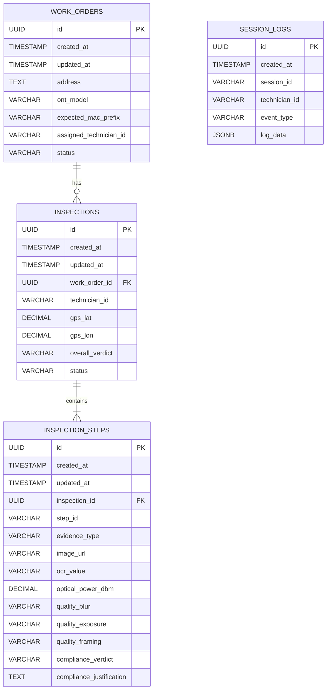

# Database Schema

## Database Engine
- **Cloud Analytics**: BigQuery (Partitioned analytical table for reports and ML analysis)
- **Live State & Cache**: Firestore (NoSQL Document Store for technician profile history, session logs, and cache)
- **Simulated DB (Local/Backend)**: PostgreSQL (Mock relational DB for work orders and inspections)

## Schema Diagram

## Tables

### `work_orders`
| Column | Type | Constraints | Description |
|--------|------|-------------|-------------|
| `id` | UUID | PK, NOT NULL | Primary key |
| `created_at` | TIMESTAMP | NOT NULL, DEFAULT NOW() | Record creation timestamp |
| `updated_at` | TIMESTAMP | NOT NULL, DEFAULT NOW() | Last update timestamp |
| `address` | TEXT | NOT NULL | Location address |
| `ont_model` | VARCHAR(50) | NOT NULL | Target device model |
| `expected_mac_prefix` | VARCHAR(17) | NOT NULL | Target MAC vendor prefix |
| `assigned_technician_id` | VARCHAR(50) | NOT NULL | Assigned technician username |
| `status` | VARCHAR(20) | NOT NULL | State: `pending`, `in_progress`, `completed` |

**Indexes:**
- `idx_work_orders_tech` on (`assigned_technician_id`, `status`)

---

### `inspections`
| Column | Type | Constraints | Description |
|--------|------|-------------|-------------|
| `id` | UUID | PK, NOT NULL | Primary key |
| `created_at` | TIMESTAMP | NOT NULL, DEFAULT NOW() | Creation timestamp |
| `updated_at` | TIMESTAMP | NOT NULL, DEFAULT NOW() | Last update timestamp |
| `work_order_id` | UUID | FK -> `work_orders.id`, NOT NULL | Link to work order |
| `technician_id` | VARCHAR(50) | NOT NULL | Technician ID |
| `gps_lat` | DECIMAL(8,6) | NULL | Latitude coordinate |
| `gps_lon` | DECIMAL(9,6) | NULL | Longitude coordinate |
| `overall_verdict` | VARCHAR(20) | NOT NULL | Audit verdict: `approved`, `rejected`, `review_required` |
| `status` | VARCHAR(20) | NOT NULL | Sync state: `draft`, `synced`, `verified` |

**Indexes:**
- `idx_inspections_work_order` on (`work_order_id`)
- `idx_inspections_tech` on (`technician_id`)

---

### `inspection_steps`
| Column | Type | Constraints | Description |
|--------|------|-------------|-------------|
| `id` | UUID | PK, NOT NULL | Primary key |
| `created_at` | TIMESTAMP | NOT NULL, DEFAULT NOW() | Creation timestamp |
| `updated_at` | TIMESTAMP | NOT NULL, DEFAULT NOW() | Last update timestamp |
| `inspection_id` | UUID | FK -> `inspections.id`, ON DELETE CASCADE, NOT NULL | Inspection container link |
| `step_id` | VARCHAR(50) | NOT NULL | Steps ID (e.g. `ont-after-closeup`) |
| `evidence_type` | VARCHAR(20) | NOT NULL | Type: `photo`, `reading` |
| `image_url` | VARCHAR(255) | NULL | GCS image location path |
| `ocr_value` | VARCHAR(100) | NULL | OCR extracted serial/MAC |
| `optical_power_dbm` | DECIMAL(5,2) | NULL | Read optical power value |
| `quality_blur` | VARCHAR(10) | NULL | Edge QA: `pass`, `fail` |
| `quality_exposure` | VARCHAR(10) | NULL | Edge QA: `pass`, `fail` |
| `quality_framing` | VARCHAR(10) | NULL | Edge QA: `pass`, `fail` |
| `compliance_verdict` | VARCHAR(10) | NOT NULL | Compliance state: `pass`, `fail` |
| `compliance_justification` | TEXT | NULL | Compliance details and fail descriptions |

**Indexes:**
- `idx_steps_inspection` on (`inspection_id`, `step_id`)

---

### `session_logs`
| Column | Type | Constraints | Description |
|--------|------|-------------|-------------|
| `id` | UUID | PK, NOT NULL | Primary key |
| `created_at` | TIMESTAMP | NOT NULL, DEFAULT NOW() | Event timestamp |
| `session_id` | VARCHAR(100) | NOT NULL | Realtime websocket session ID |
| `technician_id` | VARCHAR(50) | NOT NULL | Technician ID |
| `event_type` | VARCHAR(20) | NOT NULL | Type: `audio_turn`, `tool_call`, `error` |
| `log_data` | JSONB | NOT NULL | Payload with transcripts/tool arguments |

**Indexes:**
- `idx_session_logs_session` on (`session_id`)

---

## Migrations
Migrations are managed in `src/migrations/`.
See `.agents/skills/db-migrate.md` for migration workflow.

## Conventions
- Table names: `snake_case`, plural
- Column names: `snake_case`
- All tables have: `id`, `created_at`, `updated_at`
- Soft deletes: use `deleted_at` column when applicable
- Use UUIDs for primary keys (not auto-increment integers)
